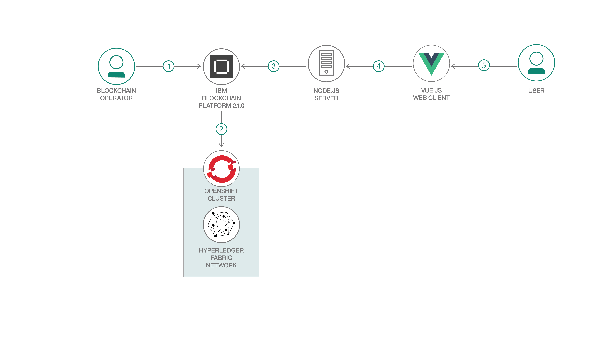

# Deploy a smart contract on the IBM Blockchain Platform running on OpenShift

🚨🚨🚨**Disclaimer: this is NOT a free pattern.** You must purchase the IBM Blockchain Platform V2.1.0 through a salesperson, and an OpenShift Cluster to run this pattern. For a free blockchain pattern, please visit either the [Fabcar Code Pattern](https://github.com/IBM/fabcar-blockchain-sample), or the [e-vote code pattern](https://github.com/IBM/evote).🚨🚨🚨

**Special thanks to Mihir Shah and Ratnakar Asara for their scripts used to deploy OpenShift.**

Blockchain is not only about cutting out the middle-man and being able to transact on a network directly with your peers but also about having nodes in multiple locations such that the network cannot be compromised through a single point of failure - decentralization is one of the most important aspects of blockchain.  The more decentralized your network is, the harder it is to bring your network down, or manipulate it maliciously. Through the power of Kubernetes, and more specifically the Red Hat OpenShift platform, the IBM Blockchain Platform is now more decentralized than ever. It can easily be deployed on all of the major cloud providers, on your own hardware, or a combination of the two. 

With the new [IBM Blockchain Platform 2.1.0](https://cloud.ibm.com/docs/services/blockchain-rhos?topic=blockchain-rhos-console-ocp-about), you now have the flexibility to deploy components on the cloud of your choice - whether that is IBM Cloud, Azure, AWS, or Google Cloud. Not only that, but you can get the same functionality that is expected with the original IBM Blockchain Platform, consistently, across different clouds, whether that is public, private, or even hybrid. More specifically, you can deploy the IBM Blockchain Platform on [any x86_64 architecture that is supported by OpenShift 3.11](https://access.redhat.com/articles/2176281) and meets the system and environment requirements. From there, you can import components from other networks, onboard other organizations to your current channel, and easily expand your network.

When the reader has completed this code pattern, they will understand how to:

* Create an OpenShift cluster.
* Log in to an OpenShift cluster.
* Create and a new project and add security and access policies.
* Deploy the IBM Blockchain console and log in to the console.
* Deploy a smart contract and run transactions on the IBM Blockchain Platform running
on OpenShift.

# Flow Diagram
<br>
<p align="center">
  
</p>
<br>

# Flow Description
1. The blockchain operator purchases an entitlement to the IBM Blockchain Platform V2.1.0.
2. The blockchain operator deploys the IBM Blockchain Platform (which is running the latest Hyperledger Fabric version) onto
a Red Hat OpenShift cluster. The operator creates a network onto the IBM Blockchain platform, eventually installing and instantiating the Fabcar smart contract on the network.
3. The Node.js application server uses the Fabric SDK to interact with the deployed network on IBM Blockchain Platform and creates APIs for a web client.
4. The Angular client uses the Node.js Fabric SDK to interact with the network.
5. The User interacts with the Fabcar Angular web application to update and query the blockchain state.

# Included components
*	[IBM Blockchain Platform v2.1.0](https://cloud.ibm.com/docs/services/blockchain-rhos?topic=blockchain-rhos-get-started-console-ocp) IBM® Blockchain Platform provides a managed and full stack blockchain-as-a-service (BaaS) offering that allows you to deploy blockchain components on any x86_64 architecture supported by the Red Hat OpenShift Container Platform 3.11
*	[Red Hat OpenShift Container Platform 3.11](https://www.openshift.com/products/container-platform) Red Hat® OpenShift® offers a consistent hybrid cloud foundation for building and scaling containerized applications. 

## Featured technologies
+ [Hyperledger Fabric v1.4.3](https://hyperledger-fabric.readthedocs.io) is a platform for distributed ledger solutions, underpinned by a modular architecture that delivers high degrees of confidentiality, resiliency, flexibility, and scalability.
+ [Node.js](https://nodejs.org) is an open source, cross-platform JavaScript run-time environment that executes server-side JavaScript code.
+ [Express.js](https://expressjs.com/) is a minimal and flexible Node.js web application framework that provides a robust set of features for web and mobile applications.
+ [Angular.io](https://angular.io/) is a front-end framework for building web applications.

## Prerequisites (Cloud)

This Cloud pattern assumes you have an **IBM Cloud account**. If you
do not have one - you can get one with the link below: 
  - [IBM Cloud account](https://tinyurl.com/y4mzxow5)
  - [Node v8.x or greater and npm v5.x or greater](https://nodejs.org/en/download)
  - [OpenShift Origin CLI](https://cloud.ibm.com/docs/openshift?topic=openshift-openshift-cli#cli_oc)

# Steps
1. [Order IBM Blockchain Platform V2.1.0](#step-1-Order-IBM-Blockchain-Platform-V2.1.0)
2. [Create an OpenShift cluster](#step-2-Create-an-OpenShift-cluster)
3. [Log in to your OpenShift cluster](#step-3-Log-in-to-your-OpenShift-cluster)
4. [Add security and access policies to your project](#step-4-Add-security-and-access-policies-to-your-project)
5. [Create a secret for your entitlement key](#step-5-Create-a-secret-for-your-entitlement-key)
6. [Deploy the IBM Blockchain Platform operator](#step-6-Deploy-the-IBM-Blockchain-Platform-operator)
7. [Deploy the IBM Blockchain Platform console](#step-7-Deploy-the-IBM-Blockchain-Platform-console)
8. [Log in to IBM Blockchain Platform console](#step-8-Log-in-to-IBM-Blockchain-Platform-console)
9. [Build a Network - Create Certificate Authority](#step-9-Build-a-Network---Create-Certificate-Authority)
10. [Build a Network - Certificate Authority - Associate Identity](#step-10-Build-a-Network---Certificate-Authority---Associate-Identity)
11. [Build a Network - Membership Service Provider](#step-11-Build-a-Network---Membership-Service-Provider)
12. [Build a Network - Create peer and ordering nodes](#step-12-Build-a-Network---Create-peer-and-ordering-nodes)
13. [Build a Network - Create and join channel](#step-13-Build-a-Network---Create-and-join-channel)
14. [Install and Instantiate Fabcar Smart Contract](#step-14-Install-and-Instantiate-Fabcar-Smart-Contract)
15. [Register a user for our client app](#step-15-Register-a-user-for-our-client-app)
16. [Update the config file](#step-16-Update-the-config-file)
17. [Start the app](#step-17-Start-the-app)
18. [Submit and check transactions](#step-18-Submit-and-check-transactions)
19. [Conclusion](#step-19-Conclusion)


## Step 1. Order IBM Blockchain Platform V2.1.0 

<br>
<p align="center">
  
</p>
<br>

The first step to getting your blockchain network to run on any [x86_64 architecture supported by RedHat OpenShift 3.11](https://docs.openshift.com/container-platform/3.11/install/prerequisites.html) is to order the IBM Blockchain Platform V2.1.0 
from [Passport Advantage](https://www.ibm.com/software/passportadvantage/pao_customer.html) online. You need to go through a salesperson first to do this. You'll likely need to create an IBMid first. 
After you create your IBMid, go ahead and log in with that email into 
Paspoint Advantage from the link above.
Once you've done this,
you can log in to [MyIBM Container Software Library](https://myibm.ibm.com/products-services/containerlibrary) with the IBMid and password you used to purchase
the software. In the **Entitlement Keys** section, select 
**Copy key** and then save that key somewhere safe.

## Step 2. Create an OpenShift cluster
Once we've gotten our entitlement key, the next step is to create our OpenShift
cluster. Note that we need to have an IBM Cloud account for this step, and we 
need to have upgraded our account to *Pay as You Go*. This means you've entered
credit card info, since this isn't free :) 

<br>
<p align="center">
  
</p>
<br>

Go ahead and log in to your [IBM Cloud account](cloud.ibm.com). From there, search
for **Kubernetes** in the cloud catalog or go [here](https://cloud.ibm.com/kubernetes/catalog/openshiftcluster). From there, click on the standard cluster, 
because there are no free lunches or free OpenShift clusters. (But there are 
free Kubernetes Clusters :) ). Next, we will fill in the following details 
before we create our cluster. THIS IS VERY IMPORTANT. If we don't allocate enough
resources to our cluster, we will not be able to deploy the IBM Blockchain Platform
to our cluster.

 - Name the cluster as you wish. **mycluster** is the default, so we will use that as the name.
 - Choose Single zone. You can choose Multizone if you wish, but it will be more
 expensive, and I'm trying to save you as much money as possible! 
 - Leave Geography as North America.
 - Leave Workeze zone as **Dallas 10**.
 - Leave the OpenShift version to be **3.11** (note that by the time you read this, versions likely will have changed, so be aware of that, and adjust accordingly.)
 - Leave Flavor to be **4 vCPUs and 16GB RAM** since this is the cheapest option.
 - Scroll all the way down to **Worker nodes**, and then make sure there are 
 **2 Worker nodes**. Note that the default is 3, but we don't need that many.

That's it for the cluster details, next click on **Create cluster** from the 
bottom left corner. Note that this may take up to 20 minutes for the cluster to
be in the ready state.

## Step 3. Log in to your OpenShift cluster

If you haven't downloaded the [OpenShift CLI](https://cloud.ibm.com/docs/openshift?topic=openshift-openshift-cli#cli_oc), do so now. 

<br>
<p align="center">
  
</p>
<br>

Go back to your OpenShift cluster, by clicking on **IBM Cloud** from the top left-corner of your dashboard. Then click on **clusters** and then click on 
the cluster you have just created. If all is well, you should see that 
all worker nodes are **Normal**. This means you are ready to rumble!

Click on **OpenShift web console** in the top-right corner. This will 
take you to the OpenShift dashboard. From there, click on your email 
in the top-right corner. From the drop-down, select **Copy Login Command**. 
Then open a new terminal window, paste the command, and you should be 
logged in! Go ahead and run the following command, to make sure 
you have OS installed. You should see the following if all went well:

```bash
~$ oc get pods
NAME                                READY     STATUS    RESTARTS   AGE
docker-registry-5544697bbf-ltcj8    1/1       Running   0          3d
docker-registry-5544697bbf-mvc85    1/1       Running   0          3d
registry-console-55cb6945bd-dsbz7   1/1       Running   0          3d
router-78d65b47b4-9wxzd             1/1       Running   0          3d
router-78d65b47b4-cr5gj             1/1       Running   0          3d
```

Nice job! You've successfully logged into your OpenShift cluster! 

## Step 4. Add security and access policies to your project

<br>
<p align="center">
  
</p>
<br>

First, go ahead and clone this repo and then go in the repo by issuing the following commands:

```bash
Workdir$ git clone https://github.com/horeaporutiu/fabcar-openshift-public
Workdir$ cd fabcar-openshift-public/
```

(Note that `git clone https://github.com/horeaporutiu/fabcar-openshift-public` automatically redirects to 
`git clone https://github.com/IBM/fabcar-openshift-public` so either one works :)

In your terminal, go ahead and run the following command to set your 
environmental variable. These are very important for the scripts that will
add security and access policies to our cluster. These are necessary before 
the deployment of the IBM Blockchain Platform onto our cluster.

```bash
 export PROJECT=ibp-demo
```

Note that I've named the project **ibp-demo** above, but you can name it anything you want.
Next, let's run some scripts that will create the project from our env variable,
apply security constraints, apply cluster role, and lastly, apply cluster role binding. 

```bash
 fabcar-openshift-public$ ./addSecurityAndAccess.sh 
```
Your output should look like the following: 


```bash
Now using project "ibp-demo" on server "https://c100-e.us-south.containers.cloud.ibm.com:31006".

securitycontextconstraints.security.openshift.io/ibp-demo created
scc "ibp-demo" added to: ["system:serviceaccounts:ibp-demo"]
scc "ibp-demo" added to groups: ["system:serviceaccounts:ibp-demo"]
cluster role "ibp-demo" added: "system:serviceaccounts:ibp-demo"
clusterrole.rbac.authorization.k8s.io/ibp-demo created
clusterrolebinding.rbac.authorization.k8s.io/ibp-demo configured
```

## Step 5. Create a secret for your entitlement key

We now need to store the entitlement key that we got from [Step 1](https://github.com/horeaporutiu/fabcar-openshift-public#step-1-create-an-openshift-cluster).

To do this, we will run the following command replacing parts of the command as listed below:

```bash
fabcar-openshift-public$ kubectl create secret docker-registry docker-key-secret --docker-server=cp.icr.io --docker-username=cp --docker-password=<KEY> --docker-email=<EMAIL> -n <PROJECT_NAME>
```
- replace *KEY* with your entitlement key.
- replace *EMAIL* with the email that you purchased the entitlement key / Blockchain Platform V2.1.0 with.
- replace <PROJECT_NAME> with your project name from the previous step.

Once you replace the variables in the command, it should look something like this: 

```bash
fabcar-openshift-public$ kubectl create secret docker-registry docker-key-secret --docker-server=cp.icr.io --docker-username=cp --docker-password=AKCp5e2g99K************YbW4Cj1UvBP1TDfuMc9EBb9wcAN19tBPU5 --docker-email=horea.porutiu@ibm.com -n ibp-demo
```

## Step 6. Deploy the IBM Blockchain Platform operator
Go ahead and run the following script to deploy the operator:

```bash
fabcar-openshift-public$ ./deployOperator.sh 
```

You should get the following output:

```bash
deployment.apps/ibp-operator created
fabcar-openshift-public$ oc get pods
NAME                           READY     STATUS              RESTARTS   AGE
ibp-operator-ddc7b5b8c-4k4s5   0/1       ContainerCreating   0          5s
```
And eventually:

```bash
ibp-operator-ddc7b5b8c-4k4s5   1/1       Running   0          1m
```

Good job! We're almost there!

## Step 7. Deploy the IBM Blockchain Platform console

Now, let's deploy the console itself!

To deploy the console we need to change a few details in the [**deployConsole.sh** script](https://github.com/horeaporutiu/fabcar-openshift-public/blob/master/deployConsole.sh). we need to modify the following details in the deployConsoleIBM.sh:

  * Replace [*DOMAIN*](https://github.com/horeaporutiu/fabcar-openshift-public/blob/master/deployConsole.sh#L14) with the name of your cluster domain. You can find this value by using the OpenShift web console. Use the dropdown menu next to OpenShift Container Platform at the top of the page to switch from Service Catalog to Cluster Console. Examine the url for that page. It will be similar to console.xyz.abc.com/k8s/cluster/projects. The value of the domain then would be xyz.abc.com, **after removing console and /k8s/cluster/projects**.
  * Replace [*EMAIL*](https://github.com/horeaporutiu/fabcar-openshift-public/blob/master/deployConsole.sh#L9) with the email address of the console administrator.
  * Replace [*PASSWORD*](https://github.com/horeaporutiu/fabcar-openshift-public/blob/master/deployConsole.sh#L10) with the password of your choice. This password also becomes the default password of the console until it is changed.

Now, go ahead and run the script - you should see the following output:

```bash
fabcar-openshift-public$ ./deployConsole.sh 
ibpconsole.ibp.com/ibpconsole configured
```

To verify your deployment, run the following command:

```bash
fabcar-openshift-public$ oc get deployments 
```

 If you see the following you have successfully deployed the console! 

```bash
NAME           DESIRED   CURRENT   UP-TO-DATE   AVAILABLE   AGE
ibp-operator   1         1         1            1           57m
ibpconsole     1         1         1            1           55m
```

## Step 8. Log in to IBM Blockchain Platform console
<br>
<p align="center">
  
</p>
<br>

Go to the following URL to log into your console. 
https://<PROJECT_NAME>-ibpconsole-console.*DOMAIN*:443

In the gif above, my domain is the following - **mycluster2-481968-37a53622c16dc09e3d369194be33ca3e-0001.us-south.containers.appdomain.cloud**

🚧🚨When you go to your console URL, your browser will display a screen that states **Your connection is not secure or Your connection is not private**. This is because your browser needs to accept the self-signed certificates that are generated by the console. Use the advanced options to make an exception and proceed to the URL.

<br>
<p align="center">
  
</p>
<br>

When you see the login screen, open a new tab in your browser and navigate to the proxy URL: https://<PROJECT_NAME>-ibpconsole-proxy.*DOMAIN*:443. You need to accept the certificate from this url to communicate with your nodes from your console.🚨🚧

Once you reach the login screen, you can use the email from the `console.yaml` file, and the
password from the same file. Once you log in for the first time, you will be asked to change the 
password. And that's it! You're done! You've now deployed the IBM Blockchain Platform on an OpenShift
Cluster. Great job!

## Step 9. Build a Network - Create Certificate Authority 

I will now go through the steps of building a network, and mostly use gifs. This 
is all based on the [build a network tutorial](https://cloud.ibm.com/docs/services/blockchain/howto?topic=blockchain-ibp-console-build-network#ibp-console-build-network) on IBM Cloud. You can refer to that tutorial if you get stuck. I will now show you gifs 
and exactly what you need to do to build a network. After that, I'll
instantiate the fabcar smart contract, which is based on the [fabcar Hyperledger Fabric tutorial](https://hyperledger-fabric.readthedocs.io/en/release-1.4/write_first_app.html). If you want to install something else, or just need to build a network, 
feel free to use the guide below and adjust as needed. The OpenShift part is done now, and it's all about 
the IBM Blockchain Platform from here :)

First, let's create the certificate authorities. They will create credentials 
for all nodes that will be transacting on our network. Each node will have their 
own certificates, and will use that to send transactions to the network. Only 
certificates that are allowed to be transacting on our network can pass 
the smart contract test. 

<br>
<p align="center">
  
</p>
<br>

First Organization:
- CA display name: `Org1 CA`
- CA admin enroll ID: `admin`
- CA admin enroll secret: `adminpw`
- Click `Add Certificate Authority`

Ordering Organization:
- CA display name: `Orderer CA`
- CA admin enroll ID: `admin`
- CA admin enroll secret: `adminpw`
- Click `Add Certificate Authority`

Wait 'till the nodes turn green, as shown in the last part of the gif. Once 
they turn green, you can move along to the next step. 

## Step 10. Build a Network - Certificate Authority - Associate Identity 
This gif goes really fast, so you may need to refer to the values below.

<br>
<p align="center">
  
</p>
<br>

Click Associate Identity for Org1 CA:
- enroll ID: `admin`
- enroll secret: `adminpw`
- Identity display name: `Org1 CA Identity`

Click register user within Org1 CA node:
- enroll ID: `org1admin`
- enroll secret: `org1adminpw`
- Type: `client`
- Click `Next`
- Click `Register user`

Click register user within Org1 CA node:
- enroll ID: `peer1`
- enroll secret: `peer1pw`
- Type: `peer`
- Click `Next`
- Click `Register user`


Now we will do the same for Ordering Org.
<br>
<p align="center">
  
</p>
<br>

Click Associate Identity for Ordering CA:

- enroll ID: `admin`
- enroll secret: `adminpw`
- Identity display name: `Orderer CA Admin`

Click register user within Ordering CA node:
- enroll ID: `OSadmin`
- enroll secret: `OSadminpw`
- Type: `client`
- Click `Next`
- Click `Register user`

Click register user within Ordering CA node:
- enroll ID: `OS1`
- enroll secret: `OS1pw`
- Type: `peer`
- Click `Next`
- Click `Register user`

## Step 11. Build a Network - Membership Service Provider

The membership provider creates the identity that is eventually checked by
the consensus (or endorsement policy in Hyperledger Fabric terms). Each 
time a peer transacts on the network, they sign their transaction with their 
key, which is linked to an identity that is provided by the membership service 
provider. The certificate authority creates the certificates, and then the 
membership service providers links those certificates to a certain identity. 
The identity is stored in your wallet tab, in the IBM Blockchain Platform.

Let's create the identity for the Org1 MSP. 

<br>
<p align="center">
  
<br>

Click on **Organizations** in the left hand side. Click **create MSP definition.**
- MSP display name: `Org1 MSP`
- MSP ID: `org1msp`
- Root cert Auth: `Org1 CA`
- enroll ID: `org1admin`
- enroll secret: `org1adminpw`
- Identity name: `Org1 MSP Admin`

Click **Export**. Click **Create MSP definition.**

Next, let's create the identity for the Ordering Service MSP.

<br>
<p align="center">
  
</p>
<br>

Click on **Organizations** in the left hand side. Click **create MSP definition.**
- MSP display name: `Orderer MSP`
- MSP ID: `orderermsp`
- Root cert Auth: `Orderer CA`
- enroll ID: `OSadmin`
- enroll secret: `OSadminpw`
- Identity name: `Ordering MSP Admin`

Click **Export**. Click **Create MSP definition.**

If you check your wallet now, you should have both the Ordering MSP Admin and the Org1 MSP admin
identities. Note that in the gif, I edited the identity name. You do not need to do so.

## Step 12. Build a Network - Create peer and ordering nodes

Now that we have the identities associated with our certificates from both the Org1 and Ordering service, 
we can go ahead and create peer and ordering nodes for those identities.

<br>
<p align="center">
  
</p>
<br>

Click **Nodes** on left hand side bar. Click **Add peer**. Click **Create a peer**.
- Peer display name: `Peer Org1`
- Certificate Authority: `Org1 CA`
- Peer enroll ID: `peer1`
- Peer enroll Secret: `peer1pw`
- Org MSP: `Org1 MSP`
- TLS CA enroll ID: `admin`
- TLS CA enroll secret: `adminpw`
- Associate Identity, existing Identity: `Org1 MSP Admin`

Click **Add peer**.

<br>
<p align="center">
  
</p>
<br>

Click **Nodes** on left hand side bar. Click **Add ordering service**. Click **Create Ordering Service**.
- Ordering service display name: `Ordering Service`
- Certificate Authority: `Orderer CA`
- Peer enroll ID: `OS1`
- Peer enroll Secret: `OS1pw`
- Org MSP: `Orderer MSP`
- TLS CA enroll ID: `admin`
- TLS CA enroll secret: `adminpw`
- Associate Identity, existing Identity: `Ordering MSP Admin`

Click **Add ordering service**. Wait a few minutes for the node to be running. When it's green, click
on your newly created ordering service node. 

<br>
<p align="center">
  
</p>
<br>

From within the Ordering service node, under Consortium members, click **add organization**.
- Existing MSP ID: `Org1 MSP`
Click **add organization**.

## Step 13. Build a Network - Create and join channel

In Hyperledger Fabric, all transactions happen within a channel. Each channel has its own ledger.
This way, you can split up a big blockchain network into multiple channels, offering more customization 
and access control. Let's create our channel. 

<br>
<p align="center">
  
</p>
<br>

Click **Channels** on left hand side bar. Click **Create Channel**.
- Channel name: `mychannel`
- Ordering service: `Ordering Serivce`
- Select Channel Member: `Org1 MSP.` Click Add. Give `Operator` permissions.
- Channel creator MSP: `Org1 MSP`
- Identity: `Org1 MSP Admin`
Click **Create channel**.

<br>
<p align="center">
  
</p>
<br>

Next, let's join our channel. Click on the channel that says**pending** from within the channels page.

- Choose from available peers: `Peer Org1`

Click **Join channel**.

## Step 14. Install and Instantiate Fabcar Smart Contract

I've included the fabcar smart contract in this repo for convenience. **You're welcome :)**.

<br>
<p align="center">
  
</p>
<br>

Click on **Smart Contracts** tab in the left-hand side. Click **Install Smart Contract**. Click
**add file**. Navigate 
to `fabcar@1.0.0.cds` from this repository. Select that and then click **Install Smart Contract**

Once the smart contract has been installed click **Instantiate**.
- Select channel: `mychannel`
- Setup endorsement policy members: `org1msp`
- Function name: `initLedger`

Note that the endorsement policy members is very important. Since we only have 1 peer, we are running
solo, but in a more advanced and production scenario, you should choose a majority of peers, especially
when running Raft consensus or Kafka.

Next, we need to export the connection profile. This is going to tell our client app which 
identities are submitting transactions, and where our nodes are physically hosted (in our 
Red Hat OpenShift cluster).

<br>
<p align="center">
  
</p>
<br>

From your installed smart contracts, click on **connect with SDK**:

- MSP for connection: `org1msp`
- Certificate Authority: `Org1 CA`

Click on **Download connection profile**.

Next, go ahead and clone the [fabcar code pattern repo](https://github.com/IBM/fabcar-blockchain-sample) 
and then move this downloaded connection profile into the `web-app/server` folder. 

## Step 15. Register a user for our client app

<br>
<p align="center">
  
</p>
<br>

Now we will register an identity for our client app (i.e. our fabcar application). First we should
rename the file since there is already a connection profile in the `fabcar-blockchain-sample/web-app/server` folder. You can rename the old one `old` and make sure the new one is named `mychannel_fabcar_profile.json`. 

Click on **Org1 CA** node and then **register user**:
- Enroll id: `app-admin`
- Enroll secret: `app-adminpw`
- Type: `client`
- Attributes: `hf.Registrar.Roles = *`

Click **Add attribute** then click **Register user**.

## Step 16. Update the config file 

Next, we must reference our certificate authority in our config file, since when we 
enroll an admin identity for our app, we need to make sure that identity is created from our 
certificate authority that is within our Red Hat OpenShift cluster.

<br>
<p align="center">
  
</p>
<br>

From the `fabcar-blockchain-sample/web-app/server` folder go ahead and run `npm install`.

From our `fabcar-blockchain-sample/web-app/server` go ahead and start editing the `config.json` file. 
Change the `caName` value to be the value from your `mychannel_fabcar_profile.json` file. It will be the
value from "organization" -> "org1msp" -> certificateAuthorities". This would be like an IP address and a port.


## Step 17. Start the app 

<br>
<p align="center">
  
</p>
<br>

From the `fabcar-blockchain-sample/web-app/server` folder go ahead and run `node enrollAdmin`.

From our `fabcar-blockchain-sample/web-app/server` go ahead and start editing the `config.json` file. 
Change the `userName` value to be `app-admin`.

Go ahead and run `npm start` in the `fabcar-blockchain-sample/web-app/server` folder.

You may 
need to open a separate terminal window for this - from the `fabcar-blockchain-sample/web-app/client` folder go ahead and run `npm start`. Once the client app has compiled, go to 
`localhost:4200` in your browser. You should see the fabcar logo. 

## Step 18. Submit and check transactions

Now we are ready to run the app to submit transactions and view the data in our blocks within our channel. 

<br>
<p align="center">
  
</p>
<br>

From within your fabcar app in your browser add in the details of your car. I made my
care called `asdf`. I was in a hurry ok :)

Next, click **create car**. Once that is done, go into your blockchain platform and click on 
**Channels** then click on `mychannel`. Click on the latest block. You should see the 
details of your `createCar` transaction in there.

## Step 19. Conclusion

This repo helped you do the following:

- Purchase IBM Blockchain Platform V2.1.0 license, which has the ability to run on Red Hat OpenShift cluster.
- Deploy Red Hat OpenShift Cluster
- Prepare your Red Hat OpenShift Cluster with the required security policies to enable the deployment 
of the IBM Blockchain Platform.
- Deployed a IBM Blockchain Platform operator and then the IBM Blockchain Platform console onto our
Red Hat OpenShift Cluster.
- Accepted the proxy certificate such that we can communicate with our blockchain network. We needed 
to go into advanced browser settings for this.
- We created a basic network for testing, one featuring one organization and an ordering node. This is the basic setup needed to test your smart contract.
- We installed and instantiated our smart contract, and created another app admin for our client app.
- We updated our config file to reference our unique certificate authority URL from our connection profile that we downloaded from our IBM Blockchain Platform instance. 
- We installed all dependencies for our server and client side apps, and then started the Angular App.
- We used the FabCar UI to create a car, and then submitted that transaction onto our network. 
- We activated our endorsement policy, and sent that transaction to the Org1 Peer. The Org1 Peer 
endorsed the transaction, so it was shown as a success and we can now see the transaction details in 
our channel details.

Great job! This is a long process, but now you are very well versed in running IBM Blockchain Platform 
on an Red Hat OpenShift Cluster. 


## Extending the code pattern
Pull requests and contribution are always welcome. Remember that a code pattern is a path to a solution, 
and not a complete solution on its own. To make this a more complete solution,
this application can be expanded in a couple of ways:

  * Use an API to verify the drivers license to make sure it is valid, and registered with the DMV.
  * Use ordering service which uses Raft consensus mechanism.

# Related IBM Developer content
* [Fabcar Code Pattern](https://github.com/IBM/fabcar-blockchain-sample)
* [IBM Code Patterns for Blockchain](https://developer.ibm.com/patterns/category/blockchain/)
* [Hyperledger Fabric Podcast](https://github.com/IBM/fabcar-blockchain-sample)

# Related links
* [Fabcar Tutorial - Hyperledger Fabric Site](https://hyperledger-fabric.readthedocs.io/en/latest/write_first_app.html)
* [Fabcar YouTube Tutorial](https://www.youtube.com/watch?v=2moCQeHCx-g)

## License
This code pattern is licensed under the Apache Software License, Version 2. Separate third-party code objects invoked within this code pattern are licensed by their respective providers pursuant to their own separate licenses. Contributions are subject to the [Developer Certificate of Origin, Version 1.1 (DCO)](https://developercertificate.org/) and the [Apache Software License, Version 2](https://www.apache.org/licenses/LICENSE-2.0.txt).

[Apache Software License (ASL) FAQ](https://www.apache.org/foundation/license-faq.html#WhatDoesItMEAN)
 
